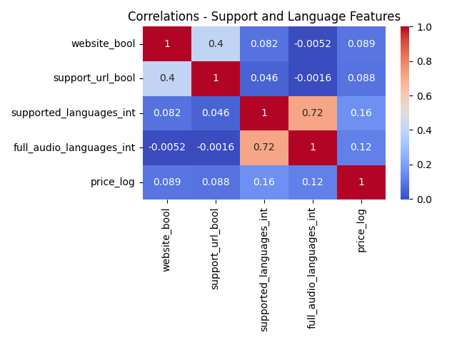
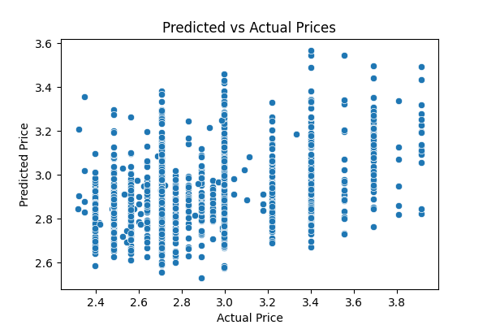
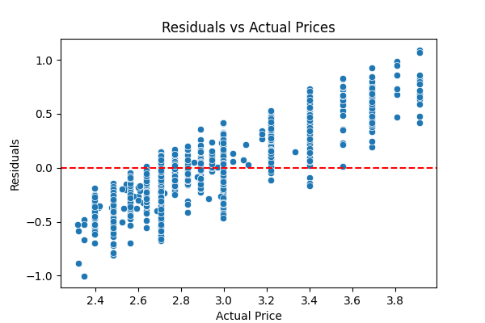

# What Drives the Price of Video Games on Steam?
(The notebook with EDA can be found <a href="https://github.com/mattbenn/capstone/blob/main/Steam%20Games_EDA.ipynb">here</a>. The notebook with modeling work can be found <a href="https://github.com/mattbenn/capstone/blob/main/Steam%20Games_Modeling.ipynb">here</a>.)

## Business Understanding & Assessing the Situation

**Determine Business Objectives:** Video games are now <a href="https://www.forbes.com/sites/forbesagencycouncil/2023/11/17/the-gaming-industry-a-behemoth-with-unprecedented-global-reach/">one of the largest enterainment industries in the world</a>, and Steam is one of the largest platforms for the distribution and hosting of personal computer (PC) games, and has been for <a href="https://archive.vn/JkIMI">over a decade</a>. Many video game developers release a variety of games on Steam of different genres, budgets, and quality, all tailored to different market segments. Developers have a strong interest in predicting which what features of games will be most predictive of price, so that they can justify setting their games at a higher price point. Therefore, high-quality data showing what characteristics of games are related to price are of great interest (and great value) to video game companies and publishers looking to distribute games to a wide PC audience.

**Assess Situation:** I am working with data from <a href="https://www.kaggle.com/datasets/artermiloff/steam-games-dataset/data">Kaggle</a>, scraped from the <a href="https://partner.steamgames.com/doc/sdk/api">Steamworks API</a>, containing data on video games sold on the Steam storefront. The data is up to date as of May 2024, which is recent enough to be relevant to developers currently forming/refining business strategies in their development and distribution of their games. The dataset contains data for games released many years ago but the price points given are those that are current as of May 2024. There are many features that consisting JSON-formatted strings holding multiple pieces of information (e.g., metadata tags, game genre, etc.), and these will have to be dealt with on a case-by-case basis, with decisions made about how to use this data to predict game price.

The main benefit from this analysis will be identifying the core characteristics of games that are associated with higher prices, but this data will not be able to show causal relationships. Some care should be taken when interpreting results.

**Data Mining Goals:** The goal of this project will be to identify the multivariate relationships in the data that predict the price point of games. The project will be deemed a success if one (or more) models can be built predicting the targets significantly above baseline and results in tangible advice that businesses could use to improve their business strategy.

**Project Plan:** The data has already been scraped from the internet, and only exploratory data analysis, data cleaning, and data modeling are left. The project will consist of the aforementioned data preprocessing and data processing steps, as well as writing a summary of findings.

## Data Understanding
The data has already been cleaned and duplicates removed. The data has 46 features in total, but only a few will be used in modeling.

I examined the target, video game price in May 2024 (<code>price</code>), and discovered that the variable was very positively skewed (i.e., there were a few games worth over $500) as well as many games with a $0 <code>price</code> (so-called "free to play" games, where developers make money through microstransactions and ads). I decided to focus my efforts on games with a price range between $10 and $100. However, <code>price</code> for these games was still significantly positively skewed, so I removed all games with a <code>price</code> greater than 3 standard deviations above the mean to remove outliers. To make the final distribution more normally distributed, I also applied a log transformation function. The final distribution for <code>price</code> looks like this:

This dataset has many possible predictors, and some of them are in unique JSON-like or list-like format. After extracting relevant information, I decided to focus on a few different categories of predictors:
<ul>
  <li><b>Support Features</b> (e.g., does the game have a dedicated website and support email) and <b>Language Availability</b> (i.e., how many languages does the game have text and audio for)</li>
  <li><b>Categories and Genres</b> of games, like 'Multi-player' (category) and 'Casual' (genre)</li>
  <li><b>Tags</b> of games (e.g., descriptors like 'Indie', 'Multiplayer', and 'Open World' that describe game elements)</li>
</ul>
There was a great deal of data munging required to transform categories and genres, and tags, into usable features. Each feature had over thirty values, and many values were barely represented in the data. I decided to keep only those tags which were present in at least 10% of the data, to avoid having too many unbalanced classes among the predictors. After all cleaning and transformation was complete, I kept the following representations of categories and genres, and tags, in the data:
<ul>
  <li><b>Categories and Genres</b>: I kept a feature representing whether a game had a specific category or genre mapped to it in the data</li>
  <li><b>Tags</b>: Tags can be added and voted on by players, and the number of players who signify that a game has a tag may be as important as the fact whether a game has a tag at all. To capture both possibilities, I created two datasets for tags: one capturing whether a game had a tag at all (with 0 and 1 values), and another dataset with the total number of times that each tag had been selected for each game.</li>
</ul>

## Exploratory Data Analysis
After all necessary data transformation, I ran EDA to check the correlations between predictors and the target (<code>price_log</code>). Due to their size, the full correlation matrices are not included below, but can be found <a href="https://github.com/mattbenn/capstone/blob/main/Steam%20Games_EDA.ipynb">in the notebook</a>.

I also checked the distribution of price against predictors.

From the EDA, we can see a few things:
<ul>
  <li><code>price_log</code> does not correlate strongly with any individual predictor, but has weak correlations with many predictors</li>
  <li>The distribution of price within categories and genres, and within tags, seems to be fairly uniform in many cases. There are a few notable exceptions, however, such as the category 'Single Player'--the price of games seems to be on average higher when this tag is not present.</li>
</ul>

Based on this, we can predict we may have to go beyond basic linear regression modeling to find a solid model.

# Data Modeling
## Ridge Regression
At this stage, I tested how well ridge regression predicts the target. Because ridge regression can handle many predictor features due to how it regularizes predictors, I tried including all the predictor categories I had identified. Additionally, I decided to test a second-degree model for Categories and Genres (which are coded as 0 and 1, to signify whether a specific category or genre was mapped to a game) to see if the interaction of the two predict game price. It is feasible, for example, that a "multiplayer first-person-shooter" sells much better than games that are only either "multiplayer" or "first-person-shooter".

The final ridge regression model predicts price fairly well. The final RMSE of the model is 0.31. Because the target (<code>price_log</code>) is the log of price, we can transform the RMSE to dollars by finding the RMSE of the exponentiated predictions and the original values. After doing so, we get an RMSE of ~$7.00, which means the predictions given by the model are usually within $7.00 of the actual price. This is not great, overall, given the range of <code>price</code> is between $10 and $51, with a mean of $19.62 and a median of $16.99. The R2 value is .160, which is not large, and this tracks with the high RMSE.

I plotted the predicted and actual values, as well as the residual values against the actual values, which produced the following:

There is some predictive power, but it is clear that much of the error is non-random, since residuals increase as actual price goes up. This suggests the model is consistenly guessing around the median or mean value of <code>price_log</code>. To test this possibility, I conducted dummy regression, using both the mean and the median. The RMSE for both models is similar (Median strategy: RMSE = 0.358, Mean strategy: RMSE = 0.349), but the R2 value is below or close to 0 for both models. The predictive model has much more success when predicting price.

## Random Forest
To see if more advanced models may improve prediction, I trained a random forest model on the same dataset. Using a grid search and fivefold cross-validation, I identified the highest-performing model. It had an R2 value of .261 (about 62% higher than the ridge regression model) and error similar to that of the ridge regression (RMSE = 0.294; in terms of original price, the RMSE = ~$6.55).

Random forest models do not use regression coefficients, but it is possible to estimate feature importance. Importance values are normalized such that their sum equals to 1. Features with importance values greater than 1/243 (the number of features in the model) are considered to contribute more to the model's performance than average. 48 features fulfilled this criteria, and three features--the interaction between the "family sharing" category and the "indie" genre, the number of supported text languages, and the number of supported audio languages--each contributed more than 5% to the model's performance.

Importance values do not indicate the direction of the relationship between predictors and target, but a correlation matrix of these features shows that games the both the "family sharing" and "indie" categories sell for *less* money, while both language features are positively related to price.

The plots comparing predicted and actual values, and residuals against actual values, show similar patterns as the regression plots.

The Random Forest model does a much better job predicting video game prices.

## Other Model
I also conducted SVM (Support Vector Machine) modeling, again with a grid search method. However, the R2 value, while better than the ridge regression, was not as strong as the random forest model (R2 = 0.225). That model is not discussed in detail here.

# Model Interpretation
Two models were discussed, both of which showed some power for predicting game prices. Looking at the top 20 features for each model, we can see some patterns emerge.

<ul>
  <li>There are a few video game tags that predict price (Anime, 2D [negatively related], Singleplayer, Pixel Graphics [negatively related], and Puzzle [negatively related]). This suggests that games that receive these tags are likely to perform better (or worse) than average.</li>
  <li>The number of supported text languages is the strongest (ridge) or second strongest (random forest) feature in each model. Similarly, the number of full audio languages was important in the random forest model but not in the ridge model.</li>
  <li>If a game has a listed website, it is likely to sell for more. Similarly, in the random forest model, games with support URLs listed were also likely to sell for more.</li>
  <li>In both models, games that had the "family sharing" category and the "indie" genre were much more likely to sell for less than other games. (This feature along contributed more than 10% to the random forest model's performance.)</li>
</ul>

For those in the video game industry, it may be profitable to prioritize video games in the above genres/categories, as well as focusing on translating the game's text into as many languages as possible. Similarly, it may be worth putting resources towards a dedicated game website--this probably communicates to players that the creators truly believe in the quality of the game.

# Next Steps & Recommendations
Although the final R2 value for the final random forest model is significantly above that of the dummy regressor models, there is still a significant amount of error in the model, and it is non-random. This means that there are more dimensions that could be included in the model to improve performance.

When I started this project, I decided against including features like developer and publisher because--even though they would likely predict price, because certain developers will produce high-value games--the goal was to create a model that was useful *for* developers and publishers when deciding where to focus their efforts. It would not be useful to learn that they could likely sell their games for more if only they were a different company. However, such information may be useful when developers and publishers are deciding which companies to partner with in the game development and deployment cycle. This is one area that would be ripe for further exploration, and including this information may help to reduce the systematic error in the final model.

It would also be possible to scrape other information from the Steam API to add to the dataset, or get other useful data from other sources. I am not an expert in this field, and someone with more domain knowledge of the video games industry could identify which other features may be useful to include in a model. Additionally, there may be other ways of preprocessing the data that may yield more useful information--I had to make decisions about how to represent categories, genres, and tags in the data that may have resulted in less predictive power.

Finally, training a deep neural network may be beneficial after including more dimensions. Due to issues with the dataset's size, I was not able to train a deep neural network for this project, and I am not sure how much it would improve performance with the current dataset--much of the dataset is a relatively sparse matrix, with most games having 0 values in most genre/category and tag features. However, deep neural networks may be able to find stronger patterns in a larger dataset with high-information features.
